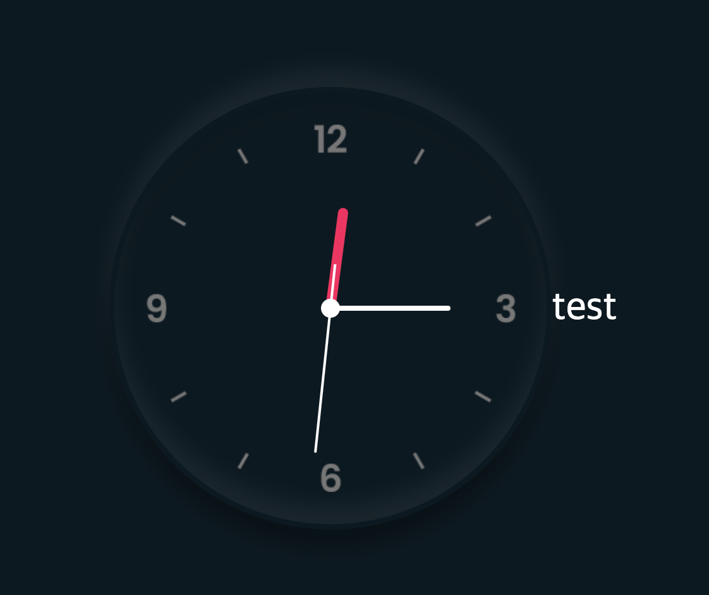

시간을 각도로 표현하는 함수
'''
setInterval(() => {
let day = new Date();
let hh = day.getHours() _ 30;
let mm = day.getMinutes() _ deg;
let ss = day.getSeconds() \* deg;

        hr.style.transform = `rotateZ(${hh + mm / 12}deg)`;
        mn.style.transform = `rotateZ(${mm}deg)`;
        sc.style.transform = `rotateZ(${ss}deg)`;
      }, 1000);

'''

# 결과물

